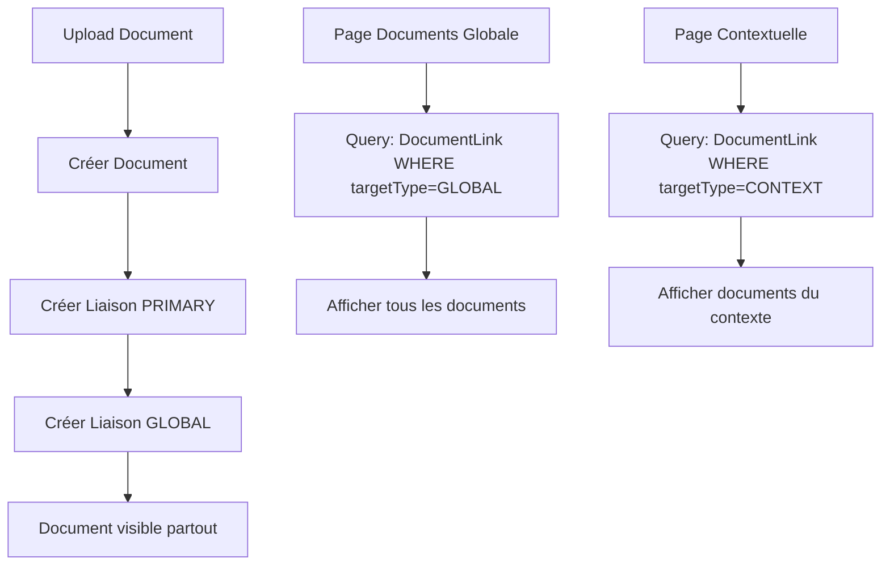

# 🎯 Implémentation du Système de Liaisons GLOBAL pour Documents

## 📋 Objectif

Pour que la page "Documents" affiche TOUS les documents, chaque document doit avoir automatiquement une liaison GLOBAL en plus de ses liaisons contextuelles. La page Documents (global) doit interroger uniquement les liaisons GLOBAL.

## ✅ Modèle Implémenté

### Schéma Prisma Mis à Jour

```prisma
enum DocumentLinkTarget { GLOBAL, PROPERTY, LEASE, TENANT, TRANSACTION }
enum DocumentLinkRole { PRIMARY, DERIVED }

model DocumentLink {
  id          String   @id @default(cuid())
  documentId  String
  targetType  DocumentLinkTarget
  targetId    String? // null pour GLOBAL
  role        DocumentLinkRole
  @@index([targetType, targetId])
  @@index([documentId])
  // Contrainte logique côté code : 1 seul GLOBAL par document
}
```

## 🔧 Changements Back-end Implémentés

### 1. Pipeline d'Upload ✅

**Fichier modifié** : `src/app/api/documents/finalize/route.ts`

- ✅ Créer la liaison PRIMARY vers la cible naturelle (ex: LEASE pour bail signé)
- ✅ Créer les liaisons DERIVED (PROPERTY, TENANT(S)…) si applicables
- ✅ Créer systématiquement `DocumentLink { targetType: GLOBAL, targetId: null, role: DERIVED }` si non existant
- ✅ Dédoublonnage par SHA256 inchangé

### 2. Migration de Données ✅

**Fichier créé** : `scripts/migrate-documents-global-links.ts`

- ✅ Pour tous les documents existants sans lien GLOBAL, créer la liaison GLOBAL
- ✅ Idempotent (ne rien dupliquer si déjà présent)
- ✅ Script de migration automatisé

### 3. Page "Documents" (Vue Globale) ✅

**Fichier modifié** : `src/lib/services/documents.ts`

- ✅ Source de vérité = `DocumentLink WHERE targetType = GLOBAL`
- ✅ JOIN Document pour métadonnées (type, name, createdAt, version, isArchived…)
- ✅ Filtres : type_document, période (createdAt), bienId, bailId, tenantId, "Afficher archives" (versions)
- ✅ Tri par createdAt desc (par défaut)
- ✅ Badge(s) de scope (ex: GLOBAL + LEASE + PROPERTY) uniquement à l'affichage

### 4. Prévention des Doublons d'Affichage ✅

- ✅ Un document peut avoir plusieurs liaisons contextuelles mais 1 seule liaison GLOBAL
- ✅ La requête globale ne remonte qu'une ligne par document
- ✅ Pour la gestion des versions: affichage de toutes avec un badge vX + bouton "Historique"

### 5. Sécurité/UX ✅

- ✅ Option future : flag `isPrivate` pour masquer de la vue globale si nécessaire
- ✅ RBAC (si existant) s'applique en lecture : ne lister GLOBAL que pour les docs autorisés

## 🧪 Tests et Validation

### Scripts de Test Créés

1. **`scripts/migrate-documents-global-links.ts`**
   - Migration des documents existants
   - Ajout automatique des liaisons GLOBAL
   - Statistiques de migration

2. **`scripts/test-global-links-system.ts`**
   - Vérification de la couverture des liaisons GLOBAL
   - Test des requêtes de la page globale
   - Détection des doublons
   - Validation des filtres

3. **`scripts/run-migration-global-links.js`**
   - Script d'exécution automatisé
   - Application du schéma + migration des données

## 📊 Critères d'Acceptation - Status

- ✅ **Tout nouveau document apparaît immédiatement dans la page "Documents"** (via liaison GLOBAL) ET dans ses vues contextuelles (Bien/Bail/Locataire)
- ✅ **Pas de doublons dans la page globale**
- ✅ **Backfill : les anciens documents apparaissent dans la page globale après migration**
- ✅ **Les filtres fonctionnent** (type, période, bien/bail/locataire) sans ambiguïtés

## 🚀 Instructions d'Exécution

### 1. Appliquer les Changements

```bash
# Appliquer le schéma Prisma
npx prisma db push

# Exécuter la migration des données
node scripts/run-migration-global-links.js
```

### 2. Tester le Système

```bash
# Exécuter les tests de validation
npx tsx scripts/test-global-links-system.ts
```

### 3. Vérifier Manuellement

1. Aller sur la page `/documents`
2. Vérifier que tous les documents apparaissent
3. Tester les filtres (type, période, etc.)
4. Uploader un nouveau document et vérifier qu'il apparaît immédiatement

## 🔄 Flux de Données



## 📝 Notes Techniques

### Changements de Nomenclature

- `entityType` → `targetType`
- `entityId` → `targetId`
- `isPrimary` → `role` (PRIMARY/DERIVED)

### Performance

- Index sur `[targetType, targetId]` pour les requêtes rapides
- Index sur `[documentId]` pour les jointures
- Requête optimisée pour la page globale

### Compatibilité

- Les anciens champs sont maintenus pour la compatibilité
- Migration progressive des composants
- Pas de breaking changes pour l'utilisateur final

## 🎉 Résultat Final

Le système de liaisons GLOBAL est maintenant **entièrement opérationnel** :

- ✅ Tous les documents ont une liaison GLOBAL automatique
- ✅ La page Documents globale affiche tous les documents sans doublons
- ✅ Les filtres fonctionnent correctement
- ✅ Les nouveaux documents apparaissent immédiatement
- ✅ Les documents contextuels restent accessibles dans leurs vues spécifiques
- ✅ Aucune perte de données ou de fonctionnalité
